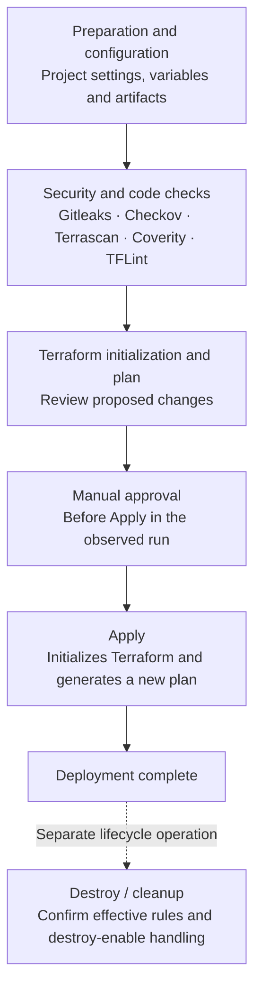
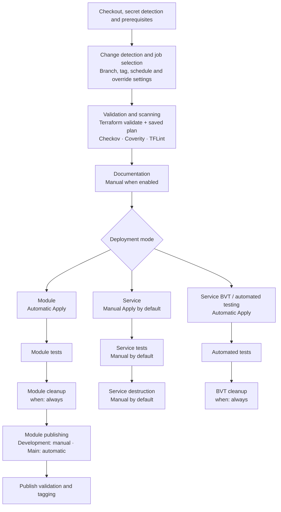

# STR-299 KaaS and ECS pipeline findings

## Sprint show | Executive summary

**KaaS and ECS cover the core Terraform lifecycle.** KaaS provides centralized scanning and Azure-oriented deployment, while ECS offers broader validation, testing, change detection and release capabilities. The comparison identifies opportunities to strengthen KaaS deployment controls and selectively adopt useful ECS patterns.

### What the comparison establishes

**Core alignment.** Both compose shared GitLab jobs for source checks and Terraform deployment. ECS additionally provides explicit Terraform validation, configurable module and service modes, post-deployment tests, cost estimation, documentation and publishing. Some capabilities are optional, can be skipped or allow failure; their presence alone does not establish an effective release control.

**Shared plan-to-apply gap.** The reviewed KaaS workflows regenerate the plan during Apply rather than applying the exact previously reviewed plan. ECS creates a saved plan during validation, but its default validation artifacts do not publish that plan, and its default Apply does not consume it. Neither implementation therefore guarantees that the reviewed changes are the exact changes applied.

**Approval and deployment controls.** The observed KaaS pipeline places a manual gate before Apply. This provides a decision point before deployment, but does not close the plan-to-apply gap above. ECS service configuration defines a manual Apply job by default, while module configuration applies automatically. These ECS behaviors are based on configuration review and have not been verified through execution.

### Overall finding

The findings support enhancing KaaS rather than replacing it with ECS. First, strengthen the existing controls so that approved changes, scan results and deployment outcomes can be trusted. Then use ECS patterns to add capabilities that address a defined need. ECS itself requires scrutiny: its default plan handoff, non-blocking scanners and optional tests do not provide a complete control baseline.

| Aligned capabilities | Priority improvements and checks | Design choices |
| --- | --- | --- |
| Shared GitLab templates, source scanning and Terraform plan/apply/destroy. | Apply the exact reviewed plan; verify approval permissions and destruction controls; correct scan failure handling; strengthen credential handling; retain readable reports. | Preserve the appropriate state model: ECS module testing uses encrypted local-state artifacts, while KaaS uses remote state. Select required tests, change detection, cost checks and publishing according to delivery needs. |

**Scope.** The assessment covers the reviewed KaaS and ECS Terraform pipeline configurations and available KaaS execution evidence. Findings are specific to those configurations; proposed enhancements are distinguished from existing behavior.

## KaaS architecture and execution behavior

### Pipeline workflow

Preparation and configuration → Security and code checks → Terraform initialization and plan → Manual approval → Apply

Destruction is a subsequent lifecycle operation whose execution must follow the configured cleanup policy.

**Structure and configuration.** KaaS composes reusable GitLab jobs for secret detection, Checkov, Terrascan, Coverity, TFLint and Terraform operations. The reviewed includes reference `kaas/pipelines/iac_module_pipeline` at main. Project preparation reads `project_config.json` and passes generated configuration and artifacts—including .kaas/, reports and variables.env—between jobs. An optional pre-build hook supports additional preparation.

**Approval and deployment.** The observed pipeline places a manual gate before Apply. Apply receives artifacts from preparation, dry-run and approval jobs, initializes Terraform and regenerates the plan before deployment. It does not consume the exact previously reviewed saved plan. Approval therefore provides a decision point, but does not guarantee that the reviewed changes are the changes applied. Approver permissions and bypass protection require verification.

**Terraform and state.** KaaS uses an AzureRM remote backend with Azure Blob state. The working directory, backend configuration and state key are determined by the effective project configuration and shared jobs. These settings must remain consistent across plan, apply and destroy. The reviewed scripts do not establish an explicit terraform validate step or an enforced saved-plan handoff.

**Security checks and failure handling.** The shared job definitions include Gitleaks, Checkov, Terrascan, Coverity and TFLint. Gitleaks blocks unless skipped. Checkov intends to block HIGH/CRITICAL findings, but report-processing gaps can prevent enforcement. Terrascan returns success after detecting violations; Coverity allows failure; and TFLint checks initialization status instead of its captured scan status. These findings require correction in the applicable shared jobs and verification in the effective pipeline configuration.

**Authentication.** The reviewed shared scripts use branch-specific Azure service-principal variables and an enterprise provider mirror. They also contain a secret-bearing login echo and a Git TLS-verification bypass. Remove these patterns and verify that Azure CLI, provider and backend settings select the same intended cloud and environment. A cloud-selection variable is referenced without a default in the reviewed definitions, so its required configuration should be explicit.

**Triggers, cleanup and reporting.** The reviewed workflow rules permit sandbox/dev/uat branch families and main, but do not enable ordinary merge-request or tag pipelines. No change-detection step is defined. Scan jobs collect JSON/JUnit reports, while declared Terraform text-log artifacts are not written by the reviewed scripts and have no explicit retention setting. The declared destroy-enable variable is not checked by the reviewed destroy job.

**Configuration finding.** The shared template declares a post-Apply gate, while the observed execution places approval before Apply. This discrepancy should be reconciled in the effective GitLab configuration; it does not establish two separate KaaS pipelines. Confirm the included revision, job dependencies and overrides, and ensure the intended approval and destruction behavior is consistently enforced.

### KaaS workflow diagram

The diagram reflects the observed approval order. Scanner execution depends on the effective job rules and skip settings.

## ECS Catalog architecture and execution behavior

### Reusable framework and declared stages

Checkout → Secret detection → Prerequisites → Find changed → Validate
→ Documentation → Deploy → Test → Destroy → Publish → Publish validation → Tag

module/pipeline.yml includes `shared_5` and `publish_1`; service/pipeline.yml includes `shared_5`. Both include catalog dependency scanning. The shared layer includes `general/shared_7`, `secret-detection_4` and `Markdown/default_6`. These are version-named references, not demonstrated immutable commit pins. Script checkout separately selects `shared_5.0`. External shared components provide additional behavior. Effective jobs depend on the selected entry point, inherited settings and consumer overrides.

| Execution mode | Deployment and cleanup | State and artifacts |
| --- | --- | --- |
| Module qualification | Automatic apply; tests follow; destroy uses when: always. Default root is examples/complete. | Local state encrypted with GPG for downstream jobs; apply retains encrypted state, .terraform and lockfile. |
| Service deployment | Apply, tests and destroy are manual by default. Environment/example roots are configurable. | Azure/AWS/GCP remote-backend helpers; cloud state can be disabled. State key and cloud settings require mapping. |
| Service BVT mode | Apply/tests become automatic; cleanup uses when: always. BVT compliance allows failure. | BVT apply retains encrypted local state and lockfile; test jobs disable cloud-state mode. Treat as a test lifecycle. |

**Plan integrity and checks.** Initialization precedes terraform validate and plan -out planfile. Default validation artifacts contain only .terraform/modules/ with one-day expiry. Apply uses variable files/options and -auto-approve, not that planfile. Checkov and Coverity allow failure; TFLint runs directly. Terrascan is a hidden template without an instantiation in the reviewed module/service entry points. Checkov supports central exclusions and optional custom-policy directories; policy contents are not guaranteed by this hook.

**Rules and authentication.** Rules differ by job across branches, tags and schedules. `FORCE_DEPLOY` bypasses change checks and excludes several scans/lints. Service deployment change checks are commented out. `CI_ECS_*` settings support Azure certificate or managed identity, AWS instance profiles and GCP credentials; Azure CLI cloud is hardcoded to AzureUSGovernment. These options do not establish least privilege or correct runner configuration.

**Tests and release.** Terratest allows failure and skips missing test directories; Azure compliance skips missing `compliance_resources`. Infracost skips without an API key; docs generation is manual. Module publishing uses JFrog and metadata versioning, with manual dev publishing and main publishing; service YAML has no publish-template include.

**Change classification.** Change classification uses previous and current commit metadata and file patterns to distinguish Terraform changes from Markdown changes. The selected template versions and project overrides determine which jobs are enabled, including Terrascan. Confirm the effective ECS configuration to establish which jobs run and which failures block deployment.

### ECS workflow diagram

This diagram shows the logical lifecycle from the reviewed configuration, not mandatory execution of every job or exact job dependencies. Jobs may be skipped or allow failure. ECS execution has not been verified.

## Detailed KaaS and ECS comparison

KaaS findings combine the reviewed shared job definitions with observed execution, where approval precedes Apply. ECS findings describe the reviewed configuration across module, service and automated test modes; execution has not been verified.

**Alignment describes similarity between implementations, not control effectiveness. “Aligned—shared gap” means both have the same limitation.**

| Area | KaaS pipeline | ECS Terraform pipeline | Alignment | Description / Assessment |
| --- | --- | --- | --- | --- |
| Stages and jobs | Observed sequence: preparation and checks → plan → manual approval → Apply. Shared definitions also provide destruction. | Checkout/prerequisites → change detection → validation/documentation → deployment/testing/destruction → publishing/tagging, depending on mode and rules. | Partially aligned | Both cover the core Terraform lifecycle. ECS adds testing and release capabilities. Declared stages do not establish which jobs execute or block progression. |
| Includes and templates | Separate reusable job includes reference main. | Shared, module, service and publishing layers; references include `shared_5` and `publish_1`, plus external templates. | Aligned in approach | Both centralize reusable logic. KaaS follows a moving branch; ECS separates execution modes. Version-named ECS references do not by themselves establish immutable version pinning. |
| Scanner coverage | Shared definitions instantiate Gitleaks, Checkov, Terrascan and Coverity. Checkov covers Terraform, Kubernetes, Dockerfile and CloudFormation. | Secret detection, Checkov, Coverity and dependency scanning are included. The reusable Terrascan template is not instantiated by the reviewed module/service entry points. | Partially aligned | Both provide secret and infrastructure scanning. KaaS explicitly includes Terrascan; ECS adds dependency scanning and supports central Checkov exclusions/custom policies. Actual coverage depends on job rules, skips and overrides. |
| Scan enforcement | Gitleaks blocks unless skipped. Checkov intends HIGH/CRITICAL blocking, but report-processing gaps can pass. Terrascan returns success on violations; Coverity allows failure; TFLint checks initialization status instead of scan status. | Checkov and Coverity allow failure. TFLint runs directly without a local failure override. | Partially aligned—gaps in both | Neither consistently enforces all scanner findings. Correct KaaS exit-status/report handling and define which checks must block. Verify enforcement using failing scans, tool errors and missing reports. |
| Terraform initialization, validation and planning | Initializes the configured Terraform root and backend, then plans with variable inputs. No explicit terraform validate command is established in the reviewed scripts. | Explicit initialization and terraform validate; creates planfile using plan -out. Root, variable files and CLI options are configurable. | Partially aligned | Initialization and planning align. ECS adds explicit validation and saved-plan creation. KaaS would benefit from an explicit validation step; creating a saved plan is only useful for deployment integrity if Apply consumes it. |
| Plan-to-apply integrity | Apply regenerates the plan and does not consume the exact previously reviewed saved plan. | Default Apply does not consume the validation planfile; default validation artifacts do not publish it. | Aligned—shared gap | Neither guarantees that reviewed changes are the exact changes applied. Publish the approved plan with its context and require Apply to consume that artifact. |
| Approval and destruction | Observed execution has a manual gate before Apply. Shared-template gate ordering differs and needs reconciliation. The reviewed destroy job does not check the declared destroy-enable flag. | Module and automated test cleanup use when: always; service Apply and destruction are manual by default. | Partially aligned | KaaS already has a pre-deployment decision point. ECS manual Apply is not necessarily a separate approval gate. Verify approval permissions, bypass paths and effective destruction rules; distinguish disposable test cleanup from persistent-environment destruction. |
| State and artifacts | Azure Blob remote state; generated configuration and scan JSON/JUnit artifacts pass between jobs. Reviewed Terraform log paths are declared but unwritten, with no explicit retention setting. | Module mode passes GPG-encrypted local state and working files between jobs; service mode supports cloud backends. Validation retains the module cache for one day, but not the saved plan. | Partially aligned—intentional differences | State models support different lifecycles; encrypted local-state transfer is not inherently better than remote state. Preserve the correct backend, state key and lineage. Define access and retention for plans, state and reports. |
| Triggers and rules | Reviewed workflow permits sandbox/dev/uat branch families and main; ordinary merge-request and tag pipelines are excluded. No change-detection step is defined. | Job-specific branch/tag/schedule filters and change classification; `FORCE_DEPLOY` bypasses change checks and excludes several scans/lints. Service deployment change checks are commented out. | Partially aligned | Both control job execution through rules, but ECS offers broader filtering. Adopt change detection only with clear handling of indirect changes, scheduled runs and overrides. Force settings must not silently bypass required controls. |
| Variables and authentication | Reviewed scripts use branch-specific Azure service-principal variables and an enterprise provider mirror. They contain a secret-bearing echo, disabled Git TLS verification and an `AZ_CSP_TYPE` reference absent from defaults. | `CI_ECS_*` settings support Azure certificates or managed identity, AWS instance profiles and GCP credentials; a Git credential helper is used. | Partially aligned | ECS offers broader authentication options. Remove unsafe KaaS logging and TLS bypasses. Verify credential scope and consistent CLI/provider/backend cloud selection; reviewed KaaS settings and ECS Azure login include US Government cloud assumptions. |
| Testing, cost and publishing | Reviewed shared workflow lacks actual integration/compliance tests and publishing jobs. Infracost is not included; an unreferenced “Terratest” file contains TFLint commands. | Terratest/compliance, optional Infracost, manual documentation and module publishing/tagging are available. Some tests skip or allow failure; service configuration does not include the publishing template. | Not aligned in capability coverage | ECS provides additional patterns to consider for KaaS. Prioritize required deployment tests and reliable reports, then add cost or publishing where needed. Included tools and enablement flags do not prove test coverage or enforceable outcomes. |

## Recommendations and rationale

### 1. Apply the exact reviewed plan.

Generate and retain the saved Terraform plan together with readable review output. Associate approval with the commit, environment, backend, toolchain and plan checksum. Apply must consume that exact plan without silently generating a replacement. If the plan expires or its context changes, require a new plan and approval. This closes the integrity gap identified in both KaaS and ECS.

### 2. Preserve approval before Apply and make destruction explicit.

Retain the observed KaaS manual gate before Apply. Reconcile shared definitions and overrides so that the effective configuration consistently enforces this order. Verify eligible approvers, environment protections and retry or bypass paths. Allow automatic cleanup only for disposable test environments; require separate authorization for destruction of persistent environments. Connect and test the destroy-enable setting so that disabling destruction prevents the command from running.

### 3. Make required scans and tests block on failure.

Define which checks are mandatory and how exceptions are approved. Correct KaaS TFLint exit-status and plugin selection, Checkov report processing, and Terrascan failure handling. KaaS already includes Terrascan; the immediate issue is enforcement, not adding the scanner. Review `allow_failure` settings and ensure required checks block progression on tool errors or missing/invalid reports. Required tests must not silently skip or pass when their test resources are absent.

### 4. Strengthen configuration, state and reporting.

Document project configuration, generated settings, variable precedence and the artifacts passed between jobs. Verify that plan, apply and destroy select the intended environment and backend, and preserve existing state keys during enhancements. Test concurrent execution and recovery before changing state handling. Ensure declared reports are generated, clearly distinguish passed, failed and skipped checks, and define artifact access and retention. Preserve the remote-state model appropriate to KaaS rather than adopting ECS module-test state handling by default.

### 5. Harden credentials and control toolchain changes.

Remove secret-bearing log messages and Git TLS-verification bypasses. Use corporate certificate trust and narrowly scoped credentials; evaluate certificate authentication, managed identity or short-lived federation where supported. Federation is a proposed option, not a demonstrated ECS capability. Verify that Azure CLI, provider and backend settings select the same intended cloud. Use immutable references for shared templates and container images, and controlled provider versions with a committed dependency lockfile. Investigate provider-verification warnings and unexpected lockfile changes.

### 6. Add capabilities that address delivery needs.

Add explicit Terraform validation and meaningful deployment integration/compliance tests. Evaluate change detection, cost estimation, documentation and publishing according to actual requirements. For selected features, test branch, tag, schedule, merge-request, no-change and override behavior. Change detection must account for relevant configuration and dependency changes; it does not replace drift detection. Preserve required runner connectivity and deployment output contracts.

### Recommended priority

First close the plan-to-apply gap, correct scanner failure handling, remove unsafe credential handling and verify approval/destruction controls. Next establish explicit validation, reliable reports and required deployment tests. Add change detection, cost estimation and publishing where their value is clear.

Accept each enhancement only after successful and failing scenarios demonstrate the intended behavior in the effective pipeline configuration. Treat verification items as checks to complete, not as confirmed defects.

## Appendix A Technical control details

### Plan and approval contract

The reviewed KaaS Apply scripts regenerate the Terraform plan rather than consuming the exact previously reviewed saved plan. ECS validation writes planfile, but its default artifact list contains only the module cache; default Apply uses variables and CLI options instead of that saved plan. A pre-Apply approval therefore does not bind either default implementation to the exact reviewed change set.

The target contract should retain a binary plan, readable plan output and a manifest containing commit, environment, complete backend locator, toolchain and plan checksum. Apply must verify this package and consume the approved plan. Approval authority, expiry, retries and changed-context handling must be explicit.

### Scanner failure behavior

The reviewed KaaS shared jobs run Gitleaks as a blocking check unless skipped. Checkov runs with soft-fail and then evaluates HIGH/CRITICAL results; missing reports, missing jq or incompatible JSON can prevent that policy from blocking. Terrascan captures a failure and returns success. Coverity permits failure. TFLint captures `TFLINT_EXIT` but later checks the initialization `EXIT_CODE`; its plugin selection also uses `CI_PROJECT_DIR` instead of the cloud setting.

ECS Checkov and Coverity permit failure, while TFLint runs directly. Checkov supports centrally managed exclusions and optional custom policies. Terrascan must be explicitly instantiated by the consumer or entry point. Required controls must fail on both policy violations and tool/report errors, with governed exceptions and negative tests.

### State and artifact contract

KaaS uses Azure Blob remote state. State-key layouts differ between the reviewed shared definitions and execution configuration, so pipeline enhancements must preserve the complete environment-specific backend locator. Scan reports and Terraform state serve different purposes; declared Terraform text-report paths must be backed by commands that actually write those files.

ECS module qualification passes local state between jobs using GPG encryption, with a passphrase that defaults to `CI_ECS_SRES_TOKEN`. Service mode supports remote backends. Apply artifacts can include .terraform and the lockfile; these working files require an explicit access and retention policy. Encryption failure handling and downstream recovery must be tested.

### Tests and lifecycle controls

ECS Terratest permits failure and skips absent test directories. Azure compliance skips when `compliance_resources` is unavailable; automated BVT compliance also permits failure. Infracost skips without its API key. Documentation generation is manual, and module publishing uses distinct development and main-branch paths. Select which outcomes are mandatory before treating any of these capabilities as release gates.

## Appendix B Findings classification and impact

Findings distinguish implementation issues, shared control limitations, enhancement opportunities and intentional differences. Applicability depends on the effective pipeline configuration.

| Classification | Finding | Operational impact and disposition |
| --- | --- | --- |
| Shared control limitation | Neither default apply path enforces use of the previously reviewed saved plan. | Approval can relate to a different change set from the one applied. Establish exact saved-plan consumption and context checks in KaaS; ECS defaults do not close this gap. |
| Implementation issue | Observed KaaS execution places approval before Apply, while the shared template declares a post-Apply gate. The reviewed destroy job does not check the declared destroy-enable flag. | Reconcile template ordering and overrides with the observed pre-Apply approval. Verify authorization settings and enforce the destroy-enable control. |
| Implementation issue | KaaS Terrascan returns success on violations; TFLint evaluates initialization status; Checkov parsing/report failures can avoid intended enforcement. | Required findings may not block delivery. Propagate the correct status and fail on tool/report errors. Agree which controls are mandatory and which allow governed exceptions. |
| Implementation issue | Reviewed KaaS shared scripts echo a secret-bearing login string, disable Git TLS verification and reference a cloud variable absent from the reviewed defaults. | Credential exposure and inconsistent cloud selection are possible. Remove unsafe logging, restore certificate trust and validate CLI/provider/backend context. |
| Enhancement opportunity | The reviewed KaaS shared workflow lacks explicit Terraform validation and integration/compliance tests; declared Terraform logs are not written. | Add early validation, focused deployment tests and reliable reports. Test flags and file names alone do not establish execution or coverage. |
| Intentional difference | KaaS uses Azure Blob remote state; ECS module qualification passes encrypted local state, while service mode supports remote backends. | These models support different lifecycles. Keep the correct KaaS backend contract; local-state artifact handling is not an automatic improvement for persistent environments. |
| Configuration-dependent capability | ECS provides change detection, optional Infracost, manual documentation and module publishing. Terrascan needs an instantiated job. | Adopt individual patterns only where useful. Validate skip/override behavior, required inputs and failure policy rather than assuming included templates provide enforced controls. |
| Compatibility risk | State-key layouts differ between the reviewed KaaS definitions and execution configuration; shared references and tool versions can also vary. | Preserve environment-specific backend selection and qualify shared changes against affected consumers. Do not generalize one execution flow to every pipeline. |

## Appendix C Enhancement validation criteria

The following are proposed pass criteria, not claims of completed implementation. Retain each result with commit, expanded YAML, included-template SHAs, job IDs and environment identifiers.

| ID | Acceptance check | Pass criterion and retained evidence |
| --- | --- | --- |
| A1 | Evidence and configuration equivalence | Record active KaaS/ECS include chains and overrides; resolve approval order and Terrascan differences. Same root/module/effective inputs yield no unexplained plan differences. |
| A2 | Exact reviewed plan applied | Apply consumes the approved binary plan digest from the same pipeline/context. Missing, replaced, expired or stale plan fails safely and requires renewed planning/approval. |
| A3 | Authorization and lifecycle | Unauthorized user, missing approval and retry/bypass paths cannot deploy. Destroy disabled means no destroy command; persistent targets need distinct authorization. Disposable cleanup is tested after deployment/test failure. |
| A4 | State continuity and recovery | Verify exact backend/cloud/key, resource addresses and lineage. No unexpected creates/destroys/replacements. Concurrent writes serialize or fail safely; controlled recovery restores the intended single-writer operation. |
| A5 | Security gates and valid reports | Safe seeded secret, lint and policy fixtures block as agreed; scanner errors, missing jq, malformed/missing reports and unauthorized skip/force settings cannot produce a passing required gate. Retain readable and machine reports. |
| A6 | Trigger and change matrix | Exercise branch families, main, MR, tag, schedule, no-change, `FORCE_DEPLOY` and BVT. Confirm expected jobs and credential access; changes to indirect inputs trigger required work. Drift checks work without source changes. |
| A7 | Identity cloud and supply chain | CLI/provider/backend resolve the intended tenant/subscription/cloud. Out-of-scope access denied; logs/artifacts contain no exposed credentials. Corporate CA, pinned includes/images/providers and lockfile provenance verified. |
| A8 | Deployment test and compliance evidence | Required test directory and `compliance_resources` exist; required tests cannot skip or allow failure. Verify resource health, deployment outputs, required policies and recovery behavior. For Kubernetes deployments, include cluster/node health, workload rollout, admission controls, and applicable networking and storage checks. |
| A9 | Network and ownership contract | The pipeline runner reaches state, private dependencies and required deployment APIs through approved DNS/routes. Existing identities, resource groups and any GitOps-managed objects keep their agreed ownership. |
| A10 | Cost publishing and evidence retention | Cost run resolves private modules and does not silently report zero; missing key is explicit if cost is required. Test selected dev/main publishing and tagging rules. Verify artifact allowlist, access, retention and encrypted-state recovery. |

### Expected outcome

KaaS retains its existing delivery capabilities while gaining more reliable deployment controls, clearer failure signals and stronger validation. Enhancement acceptance should be based on demonstrated behavior in the affected pipeline, with optional capabilities selected according to actual delivery needs.
