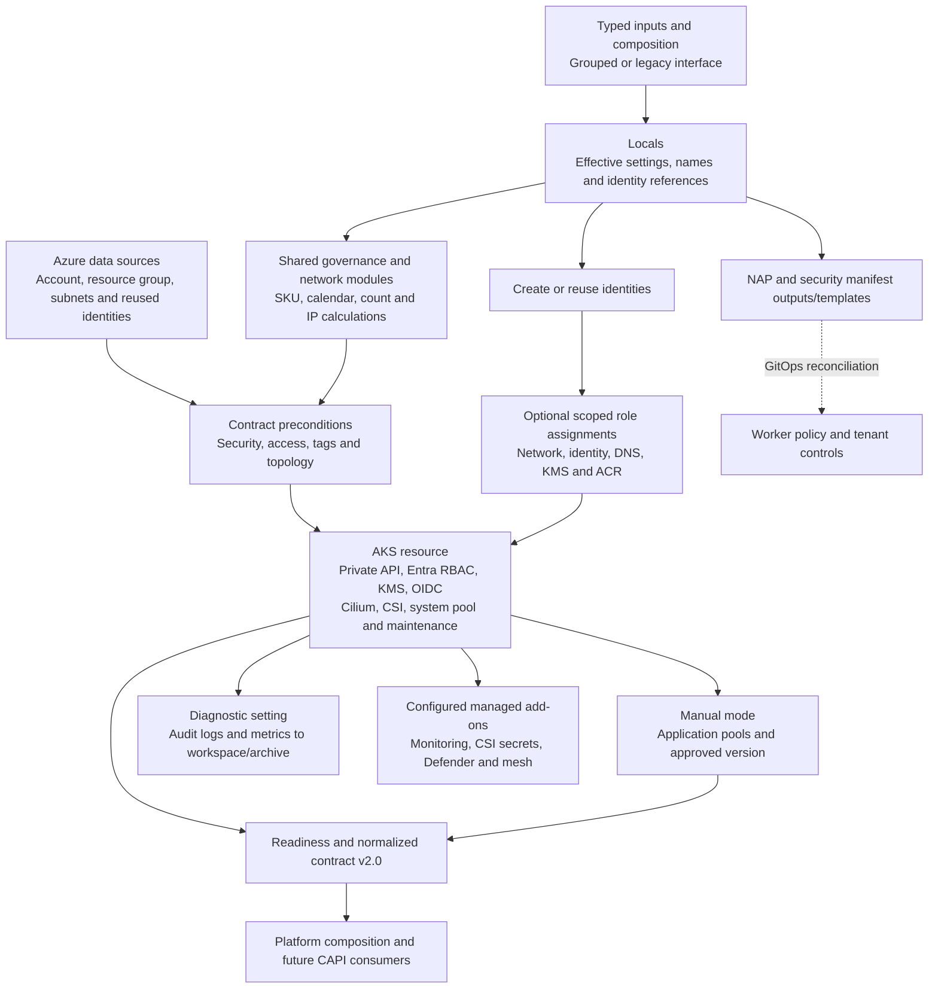

# Boeing AKS — Complete Story Implementation

**STR-126 · STR-127 · STR-128 · STR-133 · STR-134**  
**Baseline:** complete Terraform module `26.09.2`, including existing functionality and subsequent enhancements.

**Walkthrough:** Establish secure access → provision production topology → publish configuration → package the module → connect platform consumers.

## STR-126 · Complete AKS production security, audit, and access controls

| What is implemented | How it works |
|---|---|
| **Private-only control plane and nodes** | AKS always enables the private cluster, disables its public FQDN, and integrates the API server with the supplied API subnet. System and user pools disable public node IPs. Custom private DNS or AKS-managed `System` DNS supplies endpoint resolution. |
| **Private network attachment and egress** | Azure CNI Overlay and Cilium use explicit pod/service CIDRs and DNS IP. Only `userDefinedRouting` is accepted. Subnet lookups check distinct API/node attachments in the same VNet, API prefix size, node NSG/route-table attachment and disabled default outbound access. Read-only preflight checks API delegation and the default route to a virtual appliance. |
| **Separate control-plane and kubelet identities** | A creation/reuse switch either provisions both user-assigned identities or resolves supplied identities. Reuse checks subscription and exact resource IDs; identities must be distinct. AKS receives the control-plane identity plus explicit kubelet resource, client and principal IDs. Created identities have destruction protection. |
| **Scoped Azure permissions** | Optional role management grants control-plane network access, Managed Identity Operator on the kubelet identity, KMS permissions and custom-DNS/VNet permissions. The kubelet receives `AcrPull` or `Container Registry Repository Reader` according to ACR authorization mode. Explicit dependencies order AKS after module-managed assignments; preflight can inspect externally managed roles. |
| **Centralized authentication and authorization** | Entra tenant/group configuration enables Azure RBAC, requires mandatory administrator groups to remain included and disables local accounts. OIDC issuer and workload identity support application federation. SSH handling is represented as an external/provider-support ownership field. |
| **KMS-backed encryption configuration** | Every environment requires a versioned key on the Government Key Vault endpoint with private vault access. Checks match the key host to the vault and enforce the provider subscription. Preflight inspects vault RBAC, soft delete, purge protection and disabled public access. Node FIPS and host encryption are governed through pool/compliance settings. |
| **Audit routing and security integrations** | AKS diagnostics send required audit categories to Log Analytics and archive storage, with configured metrics. Optional Container Insights uses managed-identity authentication; Defender and managed Prometheus are configurable. Optional Key Vault CSI supports secret rotation; Istio uses an internal gateway and requires a PKI handoff. |
| **Runtime security handoff** | The package supplies a private-Service admission policy, restricted namespace/default-deny templates and a tenant-scoped Government secret-store example. GitOps reconciles these manifests; enterprise teams own certificate lifecycle, identity federation and archive retention. |

## STR-128 · Enforce production availability, zones, SLA tier, and node OS policy

| What is implemented | How it works |
|---|---|
| **Environment and criticality controls** | Production/DR preconditions require a non-Free SKU tier and recognized criticality. `availability_policy.criticality` must match `KAAS_TAG.tier`. Cluster SKU and support plan are explicit inputs. |
| **Multi-zone system capacity** | Production/DR require at least two distinct system-pool zones and minimum/declared counts of at least three. The system pool carries critical-addons placement, platform labels, disk settings and security configuration. |
| **Node OS and compute selection** | AzureLinux satisfies the production OS baseline. Ubuntu requires matching exception metadata with approval reference and justification. Linux/amd64 pool validation and the D/E/F SKU catalog cover general-purpose, memory-optimized and compute-optimized configurations. |
| **Manual pool provisioning and scaling** | Separate application-pool resources expose labels, taints, zones, disk settings, Spot/Regular priority and autoscaling bounds. The cluster autoscaler profile controls expansion, timing and scale-down behavior. Autoscaled system count is optional/computed; user-pool running counts are ignored for autoscaler ownership. |
| **NAP provisioning and fixed system sizing** | NAP selects AKS automatic provisioning. Terraform manages the fixed system count and emits worker `AKSNodeClass`/`NodePool` JSON containing subnet, SKU, zones, security, capacity limits and disruption settings. GitOps applies the worker policy; disruption counts must be nonnegative integers. |
| **Pool lifecycle configuration** | Explicit temporary rotation names are checked for collisions. Surge settings govern pool upgrades. Manual user pools consume the approved Kubernetes version, with their cluster reference ordering operations after the cluster resource. |

## STR-127 · Publish AKS readiness, validation, examples, and release evidence

| What is implemented | How it works |
|---|---|
| **One consolidated readiness object** | `aks_readiness` groups encryption, private API, RBAC, audit, availability, storage, upgrades, networking and naming. Domain-specific outputs expose detailed settings and external-ownership metadata. Values describe effective configuration rather than a live health probe. |
| **Network and storage configuration visibility** | The shared network module calculates Overlay `/24` blocks per node using maximum counts, surge and growth. Checks cover CIDR overlap, authoritative reserved ranges and DNS placement. Storage outputs expose Disk/File/Blob CSI, snapshots and backup handoff; Disk/File/snapshot capability is required. |
| **Version and maintenance visibility** | Outputs expose requested/configured version, approved versions, upgrade channels and shared freeze exclusions. Protected environments use manual Kubernetes upgrades. Staging uses weekly weekday windows at 22:00 PST; production/DR use monthly weekend windows at 02:00–06:00 PST. |
| **Development and production examples** | Both compositions use the same typed module contract with explicit Azure Government subscription/tenant context. Non-autoloading value templates illustrate identity, networking, security, topology and integration inputs. |
| **Consumer verification artifacts** | Native Terraform contracts, shared-module tests, preflight unit tests and verification documentation accompany the release. Version metadata, changelog and a checksum manifest identify the delivered package. |

## STR-133 · Align the AKS repository with the KaaS Terraform Module Standard

| What is implemented | How it works |
|---|---|
| **Structured infrastructure implementation** | Cluster, resource group, identities/RBAC, node pools, diagnostics, prerequisites and outputs have separate responsibilities. Shared locals derive resource names and effective settings; governance and network calculations use reusable local modules. |
| **Typed, documented configuration** | Object types, variable validation and resource preconditions define accepted inputs. Naming checks cover derived resources and rotation names; required tag groups are checked for structure, nonempty values and consistency with environment, criticality and selected features. |
| **Dependency and lifecycle management** | Terraform `>=1.9, <2.0`, AzureRM `4.81.0` and example lock files define dependency selection. Resource references and explicit dependencies order provisioning. Migration guidance describes interface changes, count ownership and replacement-sensitive settings. |
| **Reusable delivery package** | Examples, architecture/ownership guidance, migration documentation, tests, preflight tooling, version, changelog and license accompany the Terraform source. Existing GitLab automation owns quality checks, approvals and publishing. |

## STR-134 · Define ownership boundaries and normalize the AKS interface for CAPI readiness

| What is implemented | How it works |
|---|---|
| **Grouped input interface** | `module_interface` groups cluster, access and network attachment. Locals select grouped or legacy values and feed one effective configuration into resources. Additional typed objects define pools, security, maintenance and integrations. |
| **Versioned normalized outputs** | `normalized_cluster_contract` schema `2.0` exposes cluster metadata, control-plane/kubelet identities, workload identity/OIDC, private endpoint, network, pool metadata, requested/configured version and readiness. Azure resource IDs remain explicit within the structured contract. |
| **Composition and future CAPI boundary** | Consumers use stable input/output objects instead of individual resource internals. Migration guidance documents the interface transition. The package provides the integration contract for a future CAPI adapter. |
| **Explicit operational ownership** | Terraform owns AKS and optional role assignments; composition supplies environment decisions and existing resource references. Service teams own network/DNS, vault, monitoring and enterprise access. GitOps owns Kubernetes reconciliation; application teams own workloads; operations owns service lifecycle and approvals. |

## Implementation flow

<strong>Expand: follow one deployment through the module</strong>

Composition supplies the Government environment, existing resource references and cluster policy. Terraform resolves identities and attachments, computes capacity and evaluates configuration constraints. Module-managed permissions precede AKS provisioning. The cluster establishes its private endpoint, system pool and configured security/add-ons; dependent resources attach application pools and diagnostics. Outputs publish the resulting configuration, while GitOps consumes Kubernetes manifests through its separate reconciliation process.

