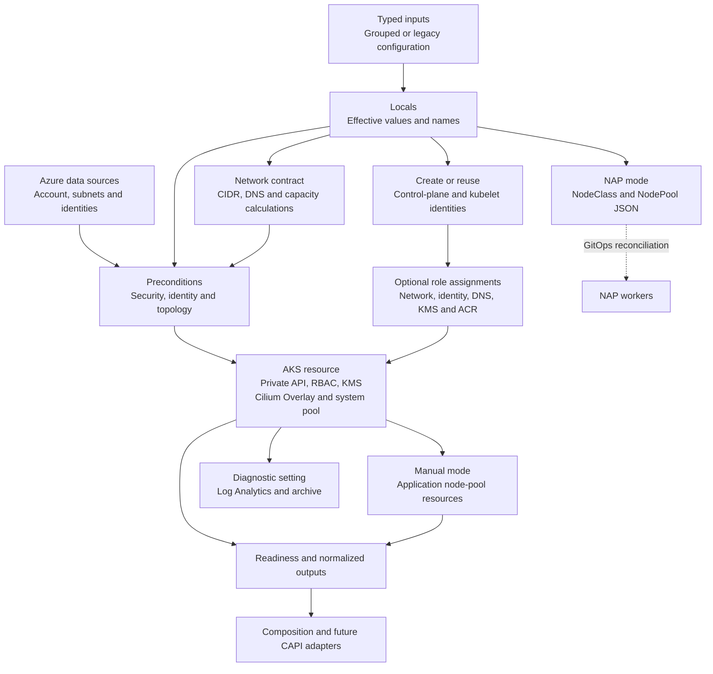

# Boeing AKS — What We Built & How It Works

**STR-126 · STR-127 · STR-128 · STR-133 · STR-134**  
Private-only AKS module

**Walkthrough:** Secure the cluster → define its topology → expose its configuration → package it for reuse → connect platform consumers.

## STR-126 · Secure the cluster

| What is done | How it’s done |
|---|---|
| **Made every cluster private.** There is a public/private switch. | AKS sets `private_cluster_enabled=true` and disables the public FQDN. API-server VNet integration attaches the control plane to the supplied API subnet. |
| **Removed public node IPs and controlled outbound routing.** | System and user pools set `node_public_ip_enabled=false`. Azure CNI Overlay/Cilium uses `userDefinedRouting` through the existing network. |
| **Separated cluster management from image-pull identity.** | Distinct user-assigned control-plane and kubelet identities are created or reused. Reuse checks the supplied IDs and subscription; AKS receives the explicit kubelet resource, client and principal IDs. |
| **Assigned permissions to the identity that needs them.** | Optional Terraform role assignments grant network, identity-operator, private-DNS and KMS permissions to the control plane. The kubelet receives `AcrPull` or `Container Registry Repository Reader`, matching registry authorization mode. |
| **Enforced centralized access and encryption configuration.** | Entra/Azure RBAC retains mandatory admin groups and disables local accounts. OIDC and workload identity are enabled. KMS requires a versioned Government Key Vault key with private vault access. |
| **Connected AKS audit destinations.** | A diagnostic setting sends configured categories, including `kube-audit` and `kube-audit-admin`, to Log Analytics and archive storage. |

## STR-128 · Define production topology

| What is done | How it’s done |
|---|---|
| **Added production/DR availability guardrails.** | Preconditions require a non-Free tier, criticality matching `KAAS_TAG.tier`, at least two distinct system-pool zones, and minimum/declared system counts of at least three. |
| **Enforced the production node OS policy.** | AzureLinux satisfies the baseline. Ubuntu requires matching exception metadata with approval reference and justification. The current pool contract accepts Linux only. |
| **Separated platform and application capacity.** | The system pool reserves capacity for critical add-ons. Manual-mode user pools carry application labels/taints, autoscaling bounds, zones, disk/security settings and upgrade surge configuration. |
| **Provided a NAP worker configuration.** | NAP mode selects automatic provisioning and emits `AKSNodeClass`/`NodePool` JSON for GitOps reconciliation, including subnet, SKU, zones and worker security settings. |

## STR-127 · Make configuration consumable

| What is done | How it’s done |
|---|---|
| **Consolidated readiness information.** | `aks_readiness` combines effective security, networking, availability, CSI storage and upgrade configuration. External-verification metadata distinguishes configuration from runtime health. |
| **Added network sizing and placement checks.** | A shared Terraform module calculates Overlay capacity using `/24` blocks per node, maximum counts, surge and growth allowance. Additional checks cover CIDR separation, DNS placement and subnet attachments. |
| **Provided development and production compositions.** | Both examples consume the same module with explicit Azure Government provider context and environment-specific inputs. |

## STR-133 · Package the module consistently

| What is done | How it’s done |
|---|---|
| **Organized provisioning into clear responsibilities.** | Cluster, identity/RBAC, pools, diagnostics, prerequisites and outputs are separated while retaining Terraform resource addresses. Typed inputs and shared locals keep configuration consistent. |
| **Created a versioned delivery package.** | Terraform/provider constraints, example lock files, contract tests, preflight checks, documentation, migration guidance, version, changelog and license accompany the module. Existing GitLab automation consumes the package. |

## STR-134 · Connect the platform components

| What is done | How it’s done |
|---|---|
| **Introduced a grouped consumer interface.** | `module_interface` groups cluster, access and network-attachment inputs. Locals resolve grouped or legacy values into the effective configuration used by resources. |
| **Published a normalized output contract.** | `normalized_cluster_contract` schema `2.0` exposes cluster metadata, identities, OIDC issuer, private endpoint, network, pools, requested/effective version and readiness. Azure resource IDs remain explicit. |
| **Defined the integration boundary.** | The module owns AKS and optional role assignments. Composition supplies environment decisions and shared-resource references. Service teams own network/DNS, vault and observability services; GitOps reconciles Kubernetes manifests. Future CAPI adapters consume the contract. |

<strong>Expand: how Terraform connects the implementation</strong>

Terraform resolves typed inputs and Azure data sources into effective locals. Network calculations and resource preconditions evaluate those values. Identity references and explicit role dependencies order AKS provisioning. User pools and diagnostics reference the resulting cluster ID; outputs assemble the configuration for consumers. NAP manifests are emitted as data for a separate GitOps reconciler.

<strong>Expand: what remains owned by shared platform services</strong>

Private DNS resolution, firewall routing, vault/key lifecycle, immutable archive retention and enterprise identity governance remain with their service owners. GitOps applies the emitted Kubernetes configuration. The module provides resource attachments, configuration and contracts for those integrations.

