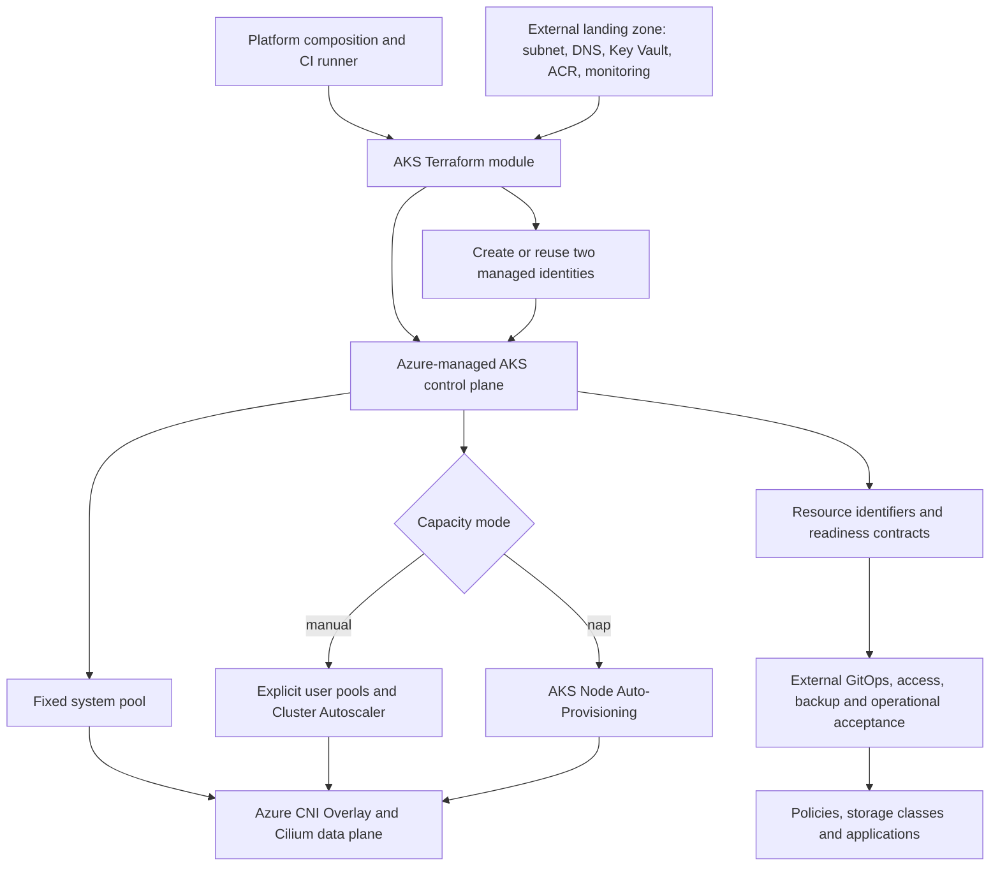
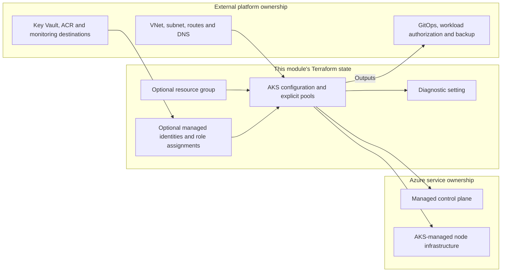
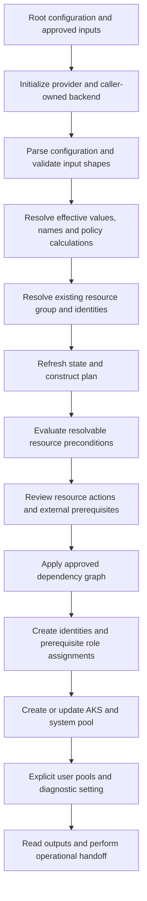
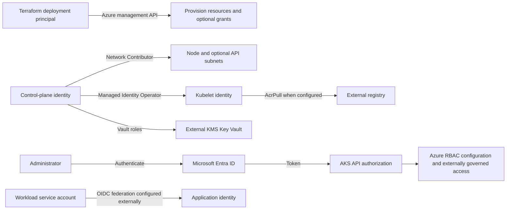
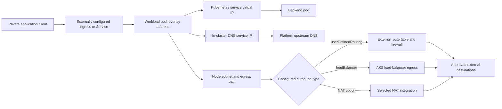
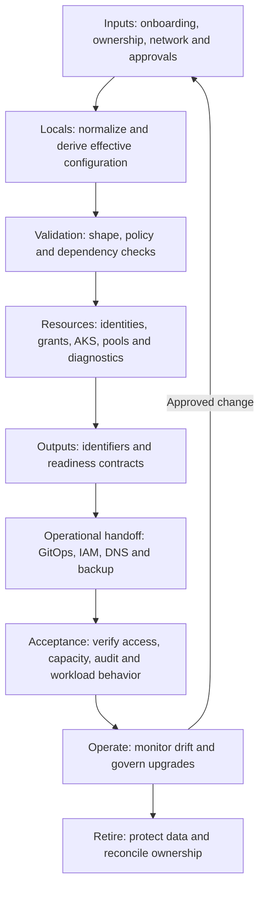

# AKS Module: End-to-End Architecture

## 1. Executive architecture summary

This module provisions and configures an Azure Kubernetes Service cluster within an externally supplied platform environment. Its architectural center is `azurerm_kubernetes_cluster.this`: an Azure-managed control plane, an explicit system node pool, Azure CNI Overlay with Cilium, separate user-assigned control-plane and kubelet identities, and configurable AKS-native security, storage, observability, and lifecycle features.

Capacity follows one of two models. `autoscaling.mode = "manual"` creates explicit pools with Cluster Autoscaler; `autoscaling.mode = "nap"` selects AKS Node Auto-Provisioning and delegates workload capacity policy to AKS and the external GitOps layer. The term **manual** describes pool definition ownership, not the absence of automatic scaling.

The module consumes existing subnet and integration resource IDs. It does not construct a complete landing zone, install application workloads, or establish operational backup, enterprise DNS, or GitOps services. Outputs form the handoff between infrastructure provisioning and those platform services. Readiness outputs primarily describe configuration and policy checks; they are not live service-health or compliance attestations.

**Source baseline:** `boeing-aks-production-module-v26.09-stories-1-9-complete.zip`, located locally in Downloads. Its internal directory retains the older name `boeing-aks-production-module-lean-v26.08-identity-reuse`. This document describes that package's Terraform and examples, including known limitations. It does not imply those limitations have been fixed or that a deployment has passed validation.

## 2. Ownership and trust boundaries

There are three distinct owners: this Terraform state, Azure's AKS service, and the external enterprise platform. The caller must assign responsibility for each dependency before deployment.

| Area | Module responsibility | External or service responsibility |
|---|---|---|
| Resource group | Create with `resource_group.create = true`, or read an existing group | Caller selects name and ownership; existing group lifecycle stays external |
| AKS | Cluster configuration and default system pool | Azure operates the managed control plane and service-created infrastructure |
| Node resource group | Supply a derived `node_resource_group` name | AKS manages its contents; no separate Terraform resource-group resource is declared for it |
| Identities | Create both identities or resolve both existing identities | Enterprise identity governance; existing identity lifecycle |
| Role assignments | Conditional assignments in `identities.tf` | All required grants when `manage_role_assignments = false`, plus grants absent from the module |
| Network | Attach pools to an existing subnet; configure cluster network profile | VNet, subnet sizing, NSGs, routes, firewall, NAT, peering and enterprise IPAM |
| Private API/DNS | Pass private API, private DNS and optional API subnet settings | Custom DNS zone permissions, VNet links, forwarding and client connectivity |
| Key Vault | Configure KMS and conditional control-plane roles | Vault/key creation, private access, key lifecycle, rotation and recovery |
| Observability | Configure AKS add-ons and diagnostic settings | Workspaces, archive accounts, retention, SIEM, alerting and investigation |
| Storage/backup | Enable CSI/snapshot capabilities and export backup contract | StorageClasses, PVCs, snapshot policies, backup installation, restore testing |
| Workload identity | Enable OIDC issuer and workload identity | Federated credentials, application identities, service accounts and workload grants |
| Kubernetes bootstrap | Export security, PKI and NAP requirements | GitOps, admission controls, PSA, NetworkPolicies and application rollout |

Creating identities and creating their permissions are independent switches. In particular, creating new identities while disabling module-managed role assignments requires external coordination before AKS creation. A single apply does not automatically pause for an external team to grant those identities access.

## 3. Terraform execution and deployment flow

Terraform loads all `.tf` files as one module and builds a dependency graph. Filenames are an organizational aid, not an execution order. `iam.tf` is a comment-only placeholder; identity resources and all current role assignments are in `identities.tf`.

The root caller owns provider authentication, subscription/cloud selection, remote state, state locking, plan review and apply authorization. The child module declares AzureRM requirements but does not configure credentials or a backend. `versions.tf` requires Terraform `>= 1.8.0, < 2.0.0` and AzureRM `>= 4.81.0, < 5.0.0`; compatibility limitations are discussed below.

Checks whose values are unknown at plan time can be deferred until apply. Preconditions on the AKS resource are not a transaction covering every independent resource: Terraform may already have created prerequisite resources when a later operation fails. Recover by inspecting state and the failed operation, correcting the cause, then planning again.

The AKS resource explicitly depends on control-plane network, kubelet identity operator, API-server network, and Key Vault assignments. `acr_pull` is not in that explicit dependency list; its resource dependencies are the kubelet identity and registry scope. Terraform completion of a role assignment also does not establish that Azure authorization propagation has completed.

## 4. Input normalization and component architecture

`module_interface` groups `cluster`, `access`, and `network_attachment`. When it is non-null, corresponding `local.effective_*` values come from this grouped object, rather than the equivalent legacy variables. This is whole-interface selection, not a field-by-field merge with legacy values. Naming, resource-group ownership, identities, network CIDRs, pools, add-ons and integrations remain separate inputs.

The legacy `kubernetes_version` variable is nullable but has no default. A direct caller using `module_interface` still needs to supply that legacy argument, potentially as `null`. The bundled development and production wrappers use legacy inputs and do not expose `module_interface` through their module calls.

| Source | Architectural function |
|---|---|
| `variables.tf` | Typed contracts, allowed values, required metadata and input validations |
| `locals.tf` | Interface precedence, naming, identity selection, production policies and IPv4 arithmetic |
| `resource_group.tf` | Mutually exclusive resource-group creation or lookup |
| `identities.tf` | Mutually exclusive identity creation/lookups and conditional Azure role assignments |
| `main.tf` | Cluster, system pool, Entra integration, network/storage profiles, add-ons, maintenance and cross-input preconditions |
| `node_pools.tf` | Additional pools keyed by `user_node_pools`, only in manual mode |
| `diagnostics.tf` | Conditional cluster diagnostic setting with logs and `AllMetrics` |
| `outputs.tf` | Resource identifiers, effective configuration and downstream handoff contracts |
| `tests/` and `.gitlab-ci.yml` | Mock plan tests and repository quality/release checks |

Production enforcement is selected strictly by `naming.environment == "prod"`. Accepted environments such as `dr` and `stage` do not automatically receive production checks. Stateful and FIPS checks are selected independently by their effective profiles.

## 5. Identity architecture and RBAC flow

The control-plane identity and kubelet identity have different jobs. The control-plane identity is configured in the AKS `identity` block with type `UserAssigned`. The kubelet identity is configured separately using its Azure resource ID, client ID and principal/object ID. Azure resource IDs identify resources and scopes; principal IDs identify security principals receiving roles; client IDs identify identities for authentication.

With `managed_identities.create = true`, the module creates both identities in the effective resource group and applies `prevent_destroy = true` to both. With `false`, complete identity resource IDs are required. Data sources extract name and resource-group name from those IDs and resolve the identities through the configured provider. The code does not select an alternate subscription from the ID, so cross-subscription reuse must not be assumed to work automatically.

| Role assignment resource | Principal | Role and scope | Creation condition beyond `manage_role_assignments` |
|---|---|---|---|
| `control_plane_network` | Control-plane identity | Network Contributor on effective node subnet | Always |
| `control_plane_kubelet_identity_operator` | Control-plane identity | Managed Identity Operator on kubelet identity | Always |
| `control_plane_api_server_network` | Control-plane identity | Network Contributor on API-server subnet | API Server VNet Integration enabled |
| `control_plane_key_vault_contributor` | Control-plane identity | Key Vault Contributor on vault | KMS enabled and private vault access |
| `control_plane_key_vault_crypto_user` | Control-plane identity | Key Vault Crypto User on vault | KMS enabled |
| `acr_pull` | Kubelet identity | AcrPull on registry | `integrations.acr_id` is non-null |

The deployment principal is separate from both AKS identities. It needs resource provisioning rights and, when role management is enabled, permission to create role assignments at the declared scopes. Turning off module role management transfers responsibility; it does not prove existing permissions are adequate.

Entra integration is configured in `azure_active_directory_role_based_access_control`, using the effective tenant, administrator groups and Azure RBAC setting. Kubernetes RBAC is always enabled. Production requires Azure RBAC, disabled local accounts, a nonempty mandatory platform-admin group set, and retention of every mandatory group. The module configures the group list but does not create Entra groups, manage membership, establish PIM/Conditional Access, or assign application/user Kubernetes authorization roles.

## 6. Network and data-plane architecture

The network implementation is fixed to `network_plugin = "azure"`, `network_plugin_mode = "overlay"`, `network_data_plane = "cilium"` and `network_policy = "cilium"`. These are not caller-selectable alternatives. Both the system pool and explicit user pools attach to `local.effective_node_subnet_id`.

Nodes use the supplied VNet subnet; pods use `network.pod_cidr`; Kubernetes service virtual addresses use `network.service_cidr`. `network.dns_service_ip` is the in-cluster DNS service address. It is distinct from the private API DNS zone and from enterprise upstream DNS. Cilium supplies the configured network-policy engine; this Terraform does not install default-deny or application NetworkPolicy resources.

This diagram shows logical traffic paths, not additional Terraform resources. The module declares no ingress controller, application Service, route table, firewall or NAT gateway resource. Optional AKS Istio gateway settings are separate add-on configuration and do not constitute application routing policy.

`network.outbound_type` accepts `loadBalancer`, `managedNATGateway`, `userAssignedNATGateway`, and `userDefinedRouting`. `network.load_balancer_sku` must be `standard` in every mode. Selecting UDR requires the external platform to provide effective routes and a functioning egress path. Selecting a load-balancer or NAT mode passes a provider setting; the module does not validate every combination against the existing subnet or target cloud. Standard load-balancer selection alone does not make application ingress public or private.

### Address validation and capacity model

`locals.tf` converts IPv4 octets to integers, derives pod/service network boundaries and checks that these ranges do not overlap. DNS must lie strictly between the service range's network and broadcast addresses. These checks do not compare either CIDR against VNet, peered network, on-premises or enterprise IPAM ranges, and do not exclude every service-reserved address.

The implemented capacity estimates are:

- Manual: `system_node_pool.max_count * system_node_pool.max_pods + sum(user pool max_count * max_pods)`.
- NAP: `network.capacity.max_nodes * network.capacity.max_pods_per_node`.
- Available addresses: `2^(32 - pod prefix)`.

Production NAP requires declared `network.capacity`; production requires a positive estimate no larger than the pod CIDR address count. This is a configuration estimate, not a complete Azure CNI Overlay allocation model. It does not model per-node allocation blocks, upgrade surge, subnet free addresses, VM quota, or regional capacity. The NAP declaration is also not applied as a runtime scaling limit. Platform capacity planning must cover those additional constraints.

The original package contains an empty-list defect in the manual estimate: `sum([])` is invalid when `user_node_pools = {}`. The document preserves this fact; it does not claim the calculation has been corrected.

## 7. Private API and DNS integration

`private_cluster.enabled` controls private cluster configuration. When enabled, `private_dns_zone_id` and `public_fqdn_enabled` are passed into AKS. For public clusters, the code sets private DNS to null and supplies `api_server_authorized_ips`. For private clusters it sets authorized ranges to null. Production requires a private API, no public FQDN, and an empty public authorized-IP list.

Private API access requires both name resolution and a network path from administrators, automation and bootstrap agents. The exported `private_fqdn` and `connect_command` do not create either capability. Credential retrieval through Azure management APIs does not establish subsequent Kubernetes API reachability.

The development example supplies `private_dns_zone_id = "System"` while disabling private mode. Production supplies a custom zone resource ID. The module neither creates that custom zone nor adds VNet links, forwarding rules, or Private DNS Zone Contributor assignments. Those permissions and topology requirements must be provisioned externally before AKS uses the zone. The examples' region/cloud-specific DNS and vault strings are placeholders and must match the actual provider environment and region.

Optional API Server VNet Integration uses `api_server_access_profile.virtual_network_integration_enabled` and a separate `api_server_subnet_id`. Validation requires the subnet ID when enabled; the module can grant the control plane Network Contributor on it. It does not create, delegate, size or inspect that subnet. Private cluster mode and API Server VNet Integration are separate configuration switches.

## 8. Node pools and autoscaling

The default pool is always named `system` and is embedded in the cluster resource. It carries platform labels, configurable zones, VM size, OS SKU, OS disk settings, maximum pods, FIPS/host encryption, critical-add-on placement, surge and rotation settings. Caller labels are merged after the defaults and can override them.

| Behavior | Manual mode | NAP mode |
|---|---|---|
| AKS provisioning mode | `Manual` | `Auto` |
| System pool sizing | Cluster Autoscaler enabled; min/max configured; initial count is min | Autoscaler disabled on this fixed pool; count from `system_node_pool.node_count` |
| Additional explicit pools | One resource per user-pool map key | No Terraform-managed user pools allowed |
| Capacity tuning | `auto_scaler_profile` emitted | External NAP policy plus `nap_default_node_pools` |
| Workload capacity handoff | Explicit pools available after creation | `nap_gitops_required` true when default pools are `None` |

Explicit user pools use `mode = "User"`, autoscaling enabled, configured min/max, and initial `node_count = max(min_count, 1)`. They support labels, taints, Regular/Spot priority, conditional Spot eviction/price, storage options, surge and rotation names. Their resource addresses are keyed by the caller's map keys; changing keys can affect resource identity even if pool names are unchanged.

Production requires at least two distinct system-pool zones. User-pool zones are validated for allowed values and uniqueness, but there is no equivalent production minimum-zone precondition for every user pool. AzureLinux is the accepted production baseline; non-AzureLinux pools require matching OS exceptions with approval reference and justification. The `architecture` input is validated and exported, but is not mapped to a dedicated provider pool argument or checked against `vm_size`.

Stateful profiles require a multi-zone system pool, conservative disruption policy and no explicit Spot pools. `disruption_profile.max_unavailable` and consolidation intent are handoff metadata; the module does not create PodDisruptionBudgets or Karpenter disruption policies. NAP workload pools require external enforcement of OS, FIPS, availability, storage and disruption requirements. KEDA and vertical pod autoscaling are independent AKS add-on switches and do not replace node capacity management.

## 9. Security, encryption and audit architecture

Security spans Azure management permissions, Kubernetes authentication/authorization, node settings, secret encryption and runtime policy. Passing one layer's validation does not establish the others.

KMS is configured through the AKS `key_management_service` block with `key_vault_key_id` and `key_vault_network_access`. Enabled KMS requires both a key ID and vault resource ID. The package accepts only `Private` vault network access, including outside production. Production requires KMS enabled. The control-plane roles described earlier are granted at vault scope when module role management is active. Vault/key provisioning, private endpoint/DNS/network reachability, retention, recovery and key rotation remain external.

Key Vault Secrets Provider is a different integration. Its add-on settings enable secret rotation and set the interval; its AKS-created identity is exposed through `key_vault_secrets_provider_identity`. The module does not grant that identity secret access or create `SecretProviderClass` objects. OIDC/workload identity is always enabled, but application federation and permissions are likewise external.

The FIPS profile requires the fixed system pool to have FIPS and host encryption enabled and requires the corresponding security contract flag. Terraform-managed Linux user pools must also enable both. This is not an attestation of end-to-end application cryptographic compliance. `platform_security.psa_enforce_level`, default-deny intent, and `pki_integration` are contracts for bootstrap; they do not install enforcement. The SSH-disable output explicitly records unsupported/external ownership in this package rather than configuring SSH disablement.

Diagnostics are created when either the Log Analytics workspace or audit archive storage ID is non-null. The setting targets the AKS cluster, emits caller-selected approved log categories and `AllMetrics`, and sets Log Analytics destination type to `Dedicated`. Production requires both destinations plus `kube-audit` and `kube-audit-admin` categories. Archive retention, immutability, access control and SIEM forwarding are not configured here.

Container Insights uses `oms_agent` with managed-identity monitoring authentication and the supplied workspace. Managed Prometheus emits a `monitor_metrics` block. Defender uses its separately supplied workspace. Azure Policy, image cleaner and optional Istio are AKS-native settings. Their switches do not prove policy assignments, monitoring dashboards, alert delivery or downstream ingestion are operational.

## 10. Storage, CSI, snapshots and backup readiness

`storage_profile` controls Azure Disk, Azure Files and Blob CSI drivers plus the snapshot controller. Stateful clusters require Disk CSI, snapshots, `backup_integration.enabled`, multi-zone system capacity and conservative disruption. These stateful checks apply regardless of whether the environment is production.

The storage lifecycle crosses ownership boundaries: GitOps installs an approved StorageClass; a workload creates a PVC; the enabled CSI integration provisions/mounts storage; application owners govern access modes, topology and retention; a separate backup system protects data and validates restoration. This module configures the cluster capabilities and exports identifiers needed for that lifecycle, but does not create those Kubernetes or backup objects.

`backup_integration.enabled` is a handoff flag. No backup vault, extension, policy, schedule or protected instance is created. Snapshot capability is not equivalent to tested backup or disaster recovery. Similarly, stateful mode does not force managed OS disks: the production example uses an ephemeral system OS disk while enabling persistent workload storage capabilities.

`storage_readiness.production_stateful_ready` checks the profile and three capability flags. It does not test mounts, provisioning, snapshot creation, backup coverage or restore success. Operational acceptance must include those exercises for stateful workloads.

## 11. Version, upgrade and maintenance governance

The requested Kubernetes version is `local.effective_kubernetes_version`; the provider-reported version is exported separately as `effective_kubernetes_version`. Production requires an explicit requested version contained in `approved_kubernetes_versions`. That set is caller-supplied governance metadata, not a query of Azure-supported versions or an enforced ceiling on service-managed upgrades.

Production accepts cluster upgrade channels `patch` or `stable` and node OS channels `NodeImage` or `SecurityPatch`. The `node-image` cluster channel, where otherwise permitted, requires `NodeImage`. Premium and AKSLongTermSupport must be paired. External release governance must verify region/cloud support, upgrade paths and compatibility before selecting versions or channels.

Separate `maintenance_window_auto_upgrade` and `maintenance_window_node_os` blocks use frequency, interval, duration, weekday, start time and UTC offset. Their `not_allowed` lists carry name, RFC3339 start/end, reason and approval reference. Only start/end are emitted into the provider exclusion blocks; governance metadata remains in inputs and readiness outputs. A freeze in the auto-upgrade list does not automatically freeze the node OS window.

The production example requests version `1.34`, patch upgrades, NodeImage updates and a year-end auto-upgrade exclusion. These are illustrative inputs, not current support recommendations. Although validation accepts monthly frequencies, the interface does not expose every monthly scheduling selector; do not assume every accepted frequency is deployable with these fields.

## 12. Naming and tagging architecture

Names are derived centrally from approved naming segments. Actual location comes from the created or looked-up resource group; `region_code` does not select an Azure region.

| Object | Actual naming behavior |
|---|---|
| Cluster | `<platform>-<maintain_org>-<environment>-<region_code>-aks` |
| Control-plane identity | `<platform>-<maintain_org>-<environment>-controlplane-<region_code>-mi` |
| Kubelet identity | `<platform>-<maintain_org>-<environment>-kubelet-<region_code>-mi` |
| Node resource group | `MC_<resource_group>_<cluster_name>_<location>`, truncated to 80 characters |
| Diagnostic setting | `diag-<cluster_name>` |
| System pool | Literal `system` |
| User pools | Caller-supplied `name`; user rotation name or truncated `<name>tmp` fallback |
| Resource group | Caller-supplied `resource_group.name`, including when created |
| DNS prefix | Cluster name truncated to 54 characters |

The five required tag groups are `ECS_CSF_TAG`, `ECS_HPOO_TAG`, `KAAS_TAG`, `KAAS_EXT_TAG` and `KAAS_INFRA_TAG`. Their values must be valid JSON strings of at most 256 characters. Selected required fields are checked. AKS preconditions align maintaining organization, environment, persistence and criticality between tags and configuration.

Tags are passed to created resource groups, created identities, the cluster and explicit pools. Existing resource groups/identities are looked up rather than retagged. Tag values such as `backup_policy`, `sla` or `network_policy` are metadata and do not activate services. `naming_readiness` checks a subset of derived names, not every Azure naming constraint or tag-governance rule; generated identity names are checked even in reuse mode.

## 13. Output and operational readiness contract

Outputs separate resource identity, effective configuration and integration intent. Consumers should use the semantic fields they need, rather than treating any one boolean as global readiness.

| Output family | Intended consumer and interpretation |
|---|---|
| `cluster_id`, `cluster_name`, resource-group outputs, `node_resource_group`, `user_node_pool_ids` | Inventory, downstream modules and operations |
| `control_plane_identity`, `kubelet_identity` | External IAM and integration automation |
| `oidc_issuer_url`, `key_vault_secrets_provider_identity` | Federation and secret-access bootstrap |
| `private_fqdn`, `portal_fqdn`, `connect_command` | Connection setup; not credentials or reachability tests |
| `node_provisioning`, `nap_gitops_required` | Capacity bootstrap and NAP policy reconciliation |
| `cluster_profile_contract`, `backup_integration`, `pki_integration_contract`, `platform_security_contract` | External implementation responsibilities |
| `production_security_readiness`, `availability_readiness`, `network_readiness`, `storage_readiness`, `upgrade_readiness`, `naming_readiness` | Detailed configuration checks and evidence inputs |
| `aks_readiness` | Consolidated encryption, API, RBAC, audit, availability, storage, upgrades, network and naming view |
| `normalized_cluster_contract` | Grouped cluster, identity, endpoint, network, node-pool, version and readiness handoff |

There is no single global operational-ready boolean. Some booleans are vacuously true outside their applicable profile. A private-vault configuration value can be true while KMS is disabled. `normalized_cluster_contract.readiness.security = "enforced"` is derived from the production environment flag, not from a live security assessment. `aks_readiness.upgrades.exclusions_configured` measures whether exclusions exist; their absence is not universally a failure.

Operational handoff must verify API DNS/connectivity, administrator authorization, image pulls, expected node capacity, policy installation, audit ingestion, workload identity and required storage/backup behavior. Exported identifiers contain no kubeconfig output, but state and plan artifacts still require caller-managed access controls.

## 14. Mutable and foundational settings

The following is a change-review classification, not a definitive AzureRM replacement matrix. The resolved provider version, current Azure state and actual Terraform plan determine update, rotation or replacement behavior.

| Change category | Examples | Required architectural review |
|---|---|---|
| Routine configuration updates | Tags, diagnostics categories, supported add-on toggles, scaler tuning | Review service impact, integration dependencies and policy consistency |
| Governed operational changes | Kubernetes version/channel, maintenance, pool limits, surge | Capacity headroom, disruption budgets, version compatibility and change window |
| Pool rotation-sensitive | VM size, OS SKU/disk settings, zones, max pods, encryption flags | Inspect rotation/replacement plan; validate quota, scheduling and persistent volume topology |
| Foundational cluster choices | Name, location, node subnet, CIDRs, private API/DNS topology, provisioning mode | Plan a migration or replacement path where required; include DNS, workloads and data |
| State/ownership changes | Resource-group create/reuse, identity create/reuse, user-pool map keys | Controlled import/state migration and explicit ownership transfer |
| Security integration changes | Tenant/groups, identity IDs, vault/key, external grants | Preserve access and encryption continuity; validate before removing old dependencies |

Created identities have `prevent_destroy`; AKS itself has no equivalent protection in this code. Switching ownership flags is not an automatic resource adoption workflow. Scaling resources have no `ignore_changes` rule for node counts in this package, so review later plans for differences involving autoscaler-managed counts. Destruction must account for retained identities, external permissions, persistent data and shared resource-group contents.

## 15. Deployment lifecycle and acceptance

1. **Onboard:** choose environment/profile, naming, tags, capacity mode, version policy and ownership switches. Confirm effective location/cloud and externally allocated network ranges.
2. **Prepare dependencies:** establish subnet/egress/DNS, Key Vault/key, workspaces/archive, identities or identity creation workflow, and deployment principal permissions.
3. **Validate and plan:** resolve provider versions, run repository checks, inspect concrete actions and all known limitations below. Confirm external grants when module role management is disabled.
4. **Apply:** execute the reviewed graph and retain state/evidence. Investigate partial failures from state rather than recreating resources blindly.
5. **Bootstrap:** use outputs to configure federated credentials, Kubernetes policies, NAP NodePool/AKSNodeClass resources where required, storage classes, PKI and backup.
6. **Accept:** demonstrate private API access, expected authorization, image pulls, workload scheduling, audit ingestion and stateful recovery where applicable. Assign owners for every outstanding handoff.
7. **Operate and retire:** monitor drift and support lifecycle, reconcile approvals and automatic changes, rehearse recovery, and protect data before controlled decommissioning.

The development example is stateless, Free tier, public API, NAP and no declared NAP capacity. Production is stateful/FIPS, Standard tier, private API, UDR, NAP with declared capacity, audit destinations and KMS. Both leave user pools empty. Production creates identities but sets `manage_role_assignments = false`, making external permission orchestration essential. Neither example is a complete landing-zone deployment or proof of target-cloud compatibility.

## 16. CI, tests and release architecture

`.gitlab-ci.yml` declares validate, lint, security, test and release stages. Validation runs recursive formatting, initialization without a backend and Terraform validation. Lint uses TFLint. Security scans configuration with Trivy and fails on HIGH/CRITICAL findings. Tests run `terraform test` with the mocked AzureRM provider fixtures in `tests/validation.tftest.hcl` and `tests/stories_1_9.tftest.hcl`.

The documentation job generates a terraform-docs table and checks it is nonempty. It does not compare committed documentation with generated output or validate architecture diagrams. The tag-only release job checks the presence of VERSION, CHANGELOG, LICENSE and documentation, requires a changelog heading and compares the tag with `v$(cat VERSION)`. It does not build/publish a ZIP, verify a checksum or deploy Azure resources.

`scripts/quality-gates.sh` runs formatting, init, validate and tests locally; TFLint and Trivy are conditional on tool availability. Consequently a local script success without those tools is not equivalent to completion of the mandatory CI jobs. Caller pipelines own credentials, environment approval, backend configuration, artifact retention and publication.

Mock tests demonstrate intended configuration/guardrail behavior. They do not establish real Azure permissions, regional availability, DNS resolution, KMS access, supported combinations, backups or production operability. The package has test defects; presence of test files must not be reported as passing release evidence.

## 17. Failure boundaries, validation guardrails and known limitations

| Failure boundary | Implemented protection | Remaining responsibility or limitation |
|---|---|---|
| Invalid input | Typed objects, enum checks and selected metadata checks | Provider/API constraints and semantic cross-resource compatibility |
| Production access/security | Private API, RBAC, local-account, mandatory-group, KMS and audit preconditions | Actual grants, connectivity, retention and runtime enforcement |
| Network | Pod/service separation, DNS placement, production capacity estimate | Enterprise overlap, Overlay allocation sizing, subnet/surge capacity and egress verification |
| Availability | Production system zones and tier; OS exception checks | Regional SKU/zone support and workload placement across zones |
| Stateful storage | Disk/snapshot/backup flag and disruption preconditions | Installed backup, protected volumes and tested restores |
| Upgrade governance | Approved requested version, channel rules and exclusion metadata | Service-supported versions and review of later automatic upgrades |
| Identity lifecycle | Create/reuse validation and created-identity destroy protection | Permission propagation, cross-subscription resolution and ownership migrations |

Specific findings in the reviewed source:

- **Empty user-pool calculation:** `local.manual_required_pod_addresses` uses an unseeded `sum` over user pools. Empty maps can cause `sum([])` failures. A separate corrected package is not assumed to be the source for this document.
- **Malformed test assertions:** several story tests use comma-separated attributes inside single-line `assert` blocks; these require correction before the suite can be relied on.
- **Terraform version floor:** `integrations` variable validation references `var.addons`, while the declared minimum Terraform version includes releases preceding support for cross-variable input validation. Use a compatible runtime and reconcile the stated minimum before release.
- **Null/invalid-value expressions:** logical operators around nullable objects and unguarded functions are not a general short-circuit safety mechanism. Null `network.capacity`, null legacy inputs, or malformed exclusion times warrant explicit validation tests; generic expression errors can precede custom messages.
- **Network validation scope:** CIDR syntax validation does not explicitly restrict both CIDRs to IPv4 even though the arithmetic is IPv4-specific. Reserved DNS addresses and per-node Overlay allocation are not fully modeled.
- **Provider feature compatibility:** outbound choices, private DNS, KMS, NAP, OS/FIPS/VM combinations and maintenance frequencies require validation against the selected AzureRM provider and actual Azure environment.

These findings are documentation of the baseline, not code changes. No successful Terraform test run, live deployment, operational readiness or story closure is asserted by this architecture document.

## 18. CAPI/CAPZ future-state mapping

The normalized interface provides useful grouping for a future Cluster API/CAPZ integration, but this repository contains no CAPI controller, CAPZ manifests, conversion adapter or adoption workflow. It remains an AzureRM Terraform implementation with Azure-specific identifiers.

| Current concept | Future mapping intent | Work still required |
|---|---|---|
| `module_interface.cluster` | Managed-cluster desired version and service configuration | Adapter and feature-parity assessment against selected CAPZ APIs |
| `module_interface.access` | Managed-cluster tenant/authentication/access configuration | Preserve Entra and external role ownership semantics |
| `network_attachment` and network profile | Existing-network references and cluster network specification | Map cloud-specific fields, private DNS and validation policy |
| Control-plane/kubelet identities | Provider identity references and grants | Separate controller credentials from AKS service identities |
| System and explicit user pools | Managed machine-pool intent | Map rollout/scale fields and resolve resource ownership |
| NAP settings | Service-managed workload capacity plus external NodePool policy | Avoid competing reconciliation of NAP and explicit pools |
| Readiness outputs | Controller status/conditions and integration contracts | Distinguish desired configuration from observed health |
| Preconditions and release checks | Admission/policy and controller validation | Port equivalent checks and preserve failure semantics |

Migration requires a deliberate ownership transfer: inventory resources/state, define parity, select supported adoption or replacement procedures, freeze competing writers, validate reconciliation and preserve rollback. Terraform and CAPZ must not independently reconcile the same cluster or pool fields. This is a future design mapping, not an implemented migration capability.

## 19. Story 1–9 cross-reference

The architecture above describes the system first. The following table locates story concerns without treating implementation presence as completed acceptance evidence.

| Story | Architecture coverage | Source/evidence anchors |
|---|---|---|
| 1 — Security, audit and access | Sections 5, 7, 9, 13 and 17 | `main.tf`, `identities.tf`, `diagnostics.tf`, `production_security_readiness`, validation tests |
| 2 — Readiness and validation evidence | Sections 3, 13, 15–17 | `aks_readiness`, examples, quality script and CI |
| 3 — Availability, tier and OS | Sections 8, 11 and 17 | `availability_policy`, OS-policy locals, AKS preconditions, `availability_readiness` |
| 4 — Version and maintenance governance | Sections 11, 14–17 | `approved_kubernetes_versions`, both maintenance exclusion lists, `upgrade_readiness` |
| 5 — Network, DNS and capacity | Sections 6–7 and 17 | `network`, IPv4/capacity locals, network preconditions, `network_readiness` |
| 6 — CSI, snapshot and backup readiness | Sections 8–10, 13 and 15 | `storage_profile`, stateful preconditions, `storage_readiness`, `backup_integration` |
| 7 — Naming and tags | Sections 4 and 12 | Naming/tag validations, derived names, `naming_readiness` |
| 8 — Module/repository/release standard | Sections 3–4 and 16–17 | `versions.tf`, CI, quality script, tests, VERSION/CHANGELOG/LICENSE |
| 9 — Boundaries and future CAPI contract | Sections 2, 4, 13 and 18 | `module_interface`, `normalized_cluster_contract`, external handoff outputs |
